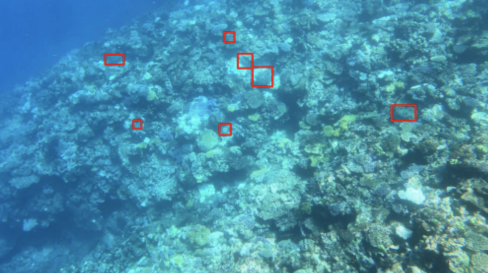

<br/>

Dataset: https://www.kaggle.com/competitions/tensorflow-great-barrier-reef/overview

Let's work with prototypes in the `prototypes` folder and follow the following
architecture for the final project.

### Some Helpful links:

- [tf.data package overview](https://www.tensorflow.org/guide/data)
- [RetinaNet in Keras](https://keras.io/examples/vision/retinanet)
- [albumnations bounding box augmentations](https://albumentations.ai/docs/getting_started/bounding_boxes_augmentation/)
- [RetinaNet Keras implementation](https://pyimagesearch.com/2020/10/05/object-detection-bounding-box-regression-with-keras-tensorflow-and-deep-learning/)
- [https://www.kaggle.com/code/soumikrakshit/yolo-v3-using-tensorflow-2-0/data](Yolov3 in TensorFlow)

## Development

To get up in and running, you should run:

```python
python setup.py develop
```

This will install all of the dependencies and get you up and running.

To test that you are properly setup, try running:

```
python entrypoints/show_samples.py
```

# Project Structure

The project should be structured as follows:

- the `data_loader` module loads the data.
- `preprocess` augments the data.
- `model` contains the modeling code.
- `visualize` module to perform visualization.
- a main driver `train.py` puts it all together to train the model.

Everything should live in the `reef-net` package except for `train.py`.

### train.py

train.py serves as the training entrypoint.  Some important notes:

- config is handled by the `ml_collections` library instead of command line flags
- experiment tracking should be done through [WAndB.ai](wandb.ai).  I'll create a project for this and set everyone up.  It makes tracking experiments much easier.

### Data Loader

The data_loader should take the `.csv` file distributed with the Kaggle dataset and load
a dataset into a `tf.data.Dataset` object.  This data pipeline tends to be pretty nice
to work with and very easy to distribute/parallelize which will save us time in the
long run.

Harsh can give this a try.

### Preprocess

We can use the `albumnations` library to augment images with bounding boxes.

Recommended reading:

- https://albumentations.ai/docs/getting_started/bounding_boxes_augmentation/
