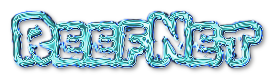
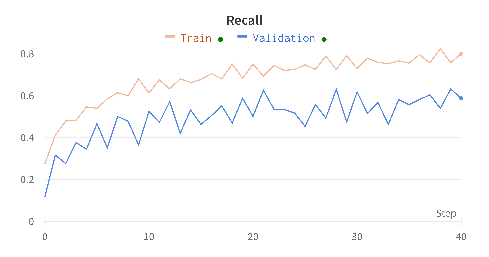

*ReefNet's predictions after each training epoch*

[Training Metrics are available in this Weights and Biases report.](https://wandb.ai/reef-net/reef-net/reports/ReefNet-Training--VmlldzoyMTQzMzcz?accessToken=u1i71ro4gv2mjjcyizen6u9bp7ohg14rvc3oxy0gs06df56s9wu18ii4ke6bs8n7)

## Overview

ReefNet is a RetinaNet implementation written in pure Keras developed to detect
[Crown-of-Thorns Starfish on the Great Barrier Reef](https://www.kaggle.com/competitions/tensorflow-great-barrier-reef/overview), which pose an existential threat to the Great Barrier Reef due to a population decline of their most common predator.
The traditional way of surveying Crown-of-Thorns Starfish is the “Manta Tow” method, where divers are towed along the reef, pausing ever so often to dive down and record how many COTS are visible. With such a large ocean bed, this method is clearly inefficient, unreliable, and costly.

[More information about the problem Crown-of-Thorns Starfish pose to the Great Barrier Reef as well as efforts to control their population can be found in our project write up](media/final_report.pdf).

ReefNet constists of custom `tf.data.Dataset` loader, a `keras.Model` subclass
implementation of RetinaNet, train test splitting for the dataset,
integration with the `keras_cv.COCOMeanAveragePrecision` and
`keras_cv.COCORecall` metrics, and a Keras callback to visualize
predictions.

## Quickstart

To get up in and running, you should run:
```bash
python setup.py develop
```

Next, you will need to download the dataset:
```
kaggle competitions download -c tensorflow-great-barrier-reef
mkdir tensorflow-great-barrier-reef
mv tensorflow-great-barrier-reef.zip tensorflow-great-barrier-reef
cd tensorflow-great-barrier-reef
unzip tensorflow-great-barrier-reef.zip
```

To test that you are properly setup, try running:

```
python entrypoints/show_samples.py
```

This script should show two images: one with no annotations and one with annotations.

## Training

To train, first follow the "Quickstart" section.

After following quickstart, you should be able to run the following:

```bash
python entrypoints/train.py --wandb --artifact_dir=artifacts
```

## Results

Below are the learning curves of Loss, Mean Average Precision (MaP), and Recall.





## Generating the Training Videos

In order to generate the training videos, you will need to first run a training run with
an `--artifact_dir` specified.  This will produce a directory such as `artifacts/train/`
that will contain a series of images.

Next, you will need to ensure you have `ffmpeg` installed.  `ffmpeg` is available in
every major package manager on every major Unix based distribution.

Following this, you may use the following script to re-generate the
`shell/create-training-video.sh` script:

```bash
./shell/create-training-video.sh {your_artifacts_dir}/train/ {some_video_name}
```

This will output the video to `media/{some_video_name}.mp4` and
`media/{some_video_name}.gif`.

## Future Efforts

Currently, the model does not achieve strong performance.  The following steps should be taken to
improve the model performance:

- experiment with multiple AnchorBox configurations
- experiment with transfer learning
- include image augmentation techniques

## Contributing

If you'd like to contribute, feel free to open a PR improving the cleanliness of the codebase,
experimenting with new anchorbox configurations, or including more data augmentation techniques.

## Thanks!
Thanks for checking out our RetinaNet implementation.
